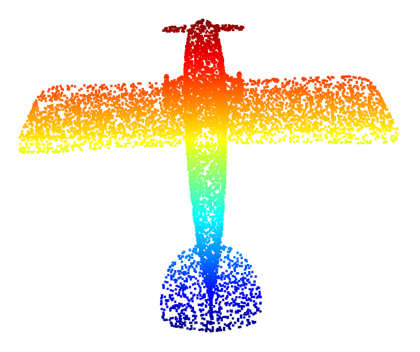
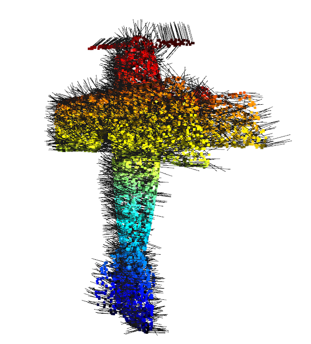
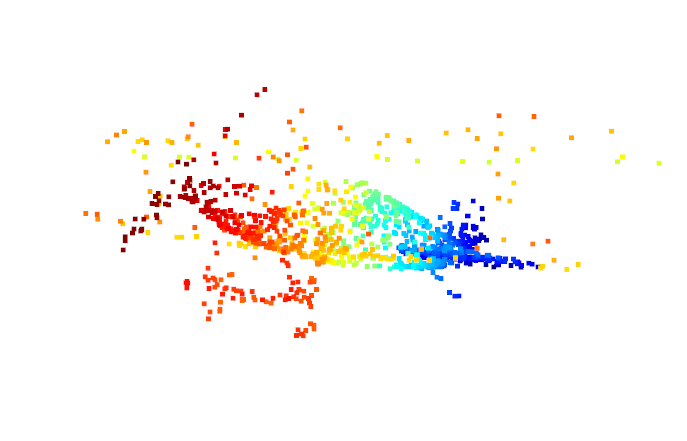

# HW1 2020.10.29
## 1. PCA 
### 1.1 思路
1. 对点云标准化
2. 求协方差矩阵特征值特征向量
3. 从大到小取前两维对数据进行降维
### 1.2 结果

## 2. Normal Estimation
### 2.1 思路
1. k近邻取点
2. 对点云标准化
3. 求协方差矩阵特征值特征向量
4. 取特征值最小的特征向量，作为法向量估计

### 2.2 结果

## 3. Voxel Down Sampling
### 3.1 思路
1. 确定各个维度的范围，即最大值最小值
2. 根据给定边长，划分网格
3. 根据网格，给点编号
4. 对编号排序
5. 每个相同编号，即相同各自内的，选取一个点/取平均值
6. 用hash加速，但此时可能出现冲突，因此引入冲突激励机制
7. 每次出现编号相同，但不在同一个格子，就选取并释放该格子
8. 最后从每个非空桶中选取一个点/取平均值
### 3.2 结果

