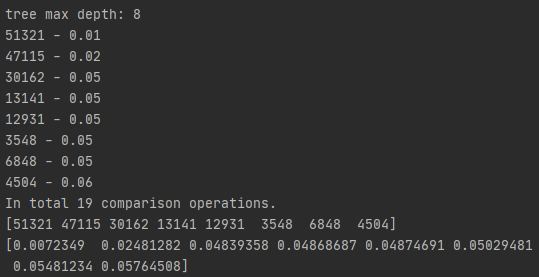
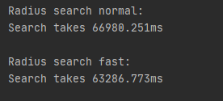
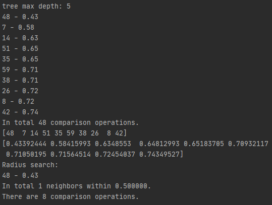
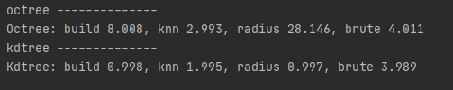

# HW2 2020.11.8
主要作业思路都在代码注释中非常详尽的写出，这里给出一些运行结果截图和关键思考
## 1. Octree 
### 1.1 关键理解
overlap函数：
1. 初步判断：这里是如果点到中心的任何一个分量 大于 半径+边长 那么区域一定在立方体外，即不重叠
2. 面接触：如果向量中有两个值都小于边长，那么一定与面接触，即三视图中，有两个视图中重叠，那么一定与面有接触
3. 角边界
这种判断方法是否完备还没有想的特别清楚
### 1.2 结果
验证正确性：

加速算法 和 原始算法对比：

## 2. KD-tree
### 2.1 思路
检索核心思路：    
1. 自顶向下定位，直到到达叶子区域
2. 向上返回时，如果出现目标点到另一侧边界的距离小于最小距离,继续向下搜索
两路之间完全对称，易于实现
### 2.2 结果
验证正确性：

## 3. Benchmark

