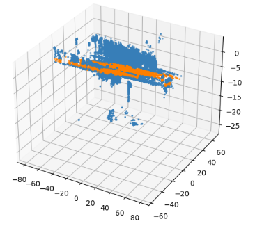

# HW4 2020.11.29

上周赶了一个学校的deadline，这周补上作业！！一定要跟上！！！

---

主要作业思路都在代码注释中非常详尽的写出，这里给出一些运行结果截图和关键思考
## 1. Ground Segmentation 
### 1.1 问题分析
分析数据集，因为地面点相对较多，因此可以将其他点视为噪声，而对整体数据进行一个平面拟合近似地面，因此问题转化为对给定平面模型，进行模型拟合估计参数的问题，可以采用本次课所学的三个model
fitting的算法
### 1.2 算法选择
由于kitti数据集是雷达采集数据，存在较多噪声和扰动，因此outlier较多，最小二乘和Hough Transform效果从原理上不如RANSAC，而且在3维上，且kitti数据量较大的情况下，霍夫变换速度可能较慢，因此选择RANSAC。

但也注意到使用RANSAC时，我们要手动确定threshold，这是这一方法的不足
### 1.3 算法描述
1. 确定迭代次数N，内点率r和阈值t
2. 随机选取1个sample（3个点）对平面进行拟合
3. 计算所有点到平面距离，根据t确定该模型对应的内点数和内点率
4. 当内点率大于r或迭代次数大于N时，结束迭代，否则重复2-3
5. 内点数最多的模型即为所求

### 1.4 算法细节
1. 使用公式计算N
2. t根据实验取0.2
3. 随机选点需要判断共线：用向量
4. 平面模型具体求解：采用PCA，取前两个特征向量确定参数

### 1.5 结果

## 2. clustering
### 2.1 问题分析
聚类问题较为明确，不再赘述，主要问题在于选取什么方法进行聚类

### 2.2 算法选择
1. 首先由于我们不对数据分布有任何假设，因此先不考虑K-means和GMM
2. 其次，从速度上，kitti数据点多，谱聚类可能效率较低
3. 最后应对3维数据，MeanShift和DBSCAN都有其局限，但DBSCAN时间复杂度更低，因此选择DBSCAN

### 2.3 DBSCAN算法描述
1. 将所有点标记为未访问
2. 构造kd-tree，确定参数radius和min_samples
3. 从unvisited集合中随机取点p，标记为被访问，RadiusNN查找所有邻居，大于min_sample,记为核心点，创建新类别C，进行步骤4，否则重复步骤3
4. 遍历p所有邻居，若n未被访问，将n记为类C，若邻居为核心点，重复4
5. 重复步骤3，直到所有点均被访问

### 2.4 算法细节
1. radius取值0.5
2. min_samples取值10

### 2.5 结果

